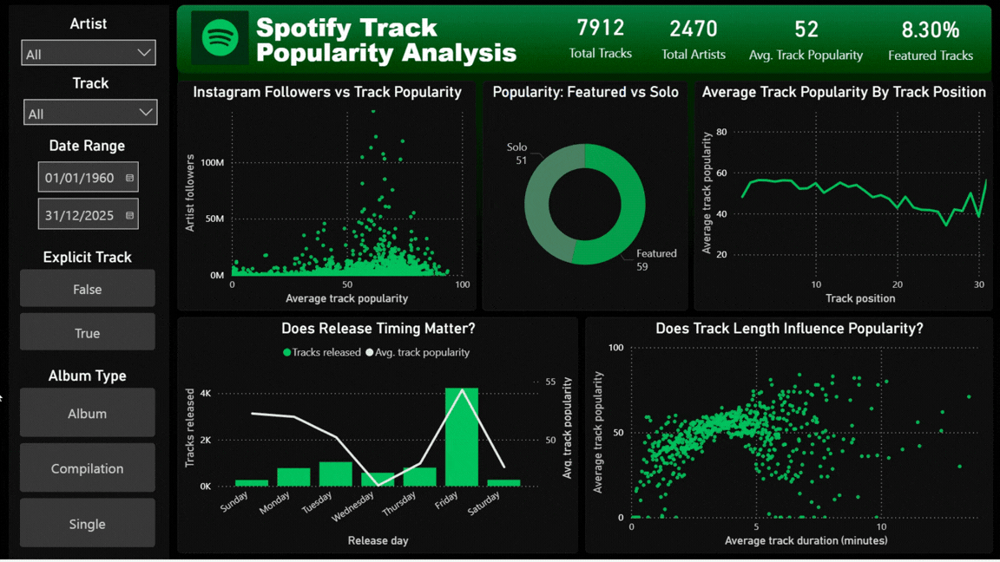

# Summary
This project analyses Spotify music data to identify patterns behind artist popularity and track success.

# Business Questions
 
- What characteristics appear in high performing tracks?
- Are featured tracks more successful than solo releases?
- Does the artists popularity correlate with the tracks popularity?
- How does track popularity vary by release day?

# Key Findings

- Tracks featuring additional artists have higher average popularity (59) than solo tracks (51), suggesting collaborations are associated with increased reach.
- Explicit tracks show higher average popularity (58) compared to non-explicit tracks (50).
- Average popularity of tracks from standard albums (55) outperform singles (46) and compilations (40).
- Artist scale strongly relates to performance, with all artists above 50M followers averaging track popularity above 50.
- Although most tracks are released on Fridays, tracks released on Sundays and Mondays show similar average popularity despite lower release volume.
- Popularity increases with track duration up to around five minutes, after which no consistent trend is observed.

# Dashboard Demonstration

<p align="center">
  
</p>
 
# Quick links
The data used in this project is from: [Spotify Global Music Dataset](https://www.kaggle.com/datasets/wardabilal/spotify-global-music-dataset-20092025?resource=download)

Find the SQL queries here: [Project SQL folder](/SQL/project_sql/)

Find the Excel analysis here: [Excel folder](/Excel/)
 
Find the Power BI dashboard here: [Track Analysis Dashboard](https://app.powerbi.com/links/KlMuJSW2Ic?ctid=e11b3463-1afc-40f2-94ae-ed3f2c1f4880&pbi_source=linkShare&bookmarkGuid=e88ab947-4640-4ebd-a059-0672df8f634d)

# Approach
Data was extracted and standardised in SQL, analysed in Excel, and visualised in Power BI.

# Power BI

**Goal:** Design a dashboard to allow non-technical users to explore trends and compare artist and track performance without writing queries.

**Functionality**
- Explore artist performance, track popularity and trends over time using filters, slicers and drill downs.
- Compare individual artists and tracks to assess which factors are associated with stronger performance.
- Examine how collaborations and explicit status relate to popularity outcomes.
- Identify when highly popular tracks tend to be released to inform release timing.

## SQL Data Preparation
The dataset contained 7912 tracks, 2470 artists and 4868 albums which requied a relational schema design to avoid duplications and allow efficient querying.

**Goal:** Convert raw Spotify data into an analysis ready relational schema.

- Designed a relational schema with fact and dimension tables.
- Standardised CSV format before joining data.
- Built bridge tables to handle many-to-many genre relationships.
- Queried the data to validate assumptions before indepth analysis.

### Top 10 Highest Impact Artists
Returns the top 10 artists ranked by highest popularity and follower count.

```sql
SELECT
    artist_key,
    artist_name,
    artist_popularity,
    artist_followers
FROM (
    SELECT
        artist_key,
        artist_name,
        artist_popularity,
        artist_followers,
        ROW_NUMBER() OVER (
            PARTITION BY artist_name
            ORDER BY artist_popularity DESC, artist_followers DESC
        ) AS rn
    FROM artists
    WHERE artist_name IS NOT NULL
) w
WHERE 
    rn = 1
ORDER BY
    artist_popularity DESC,
    artist_followers DESC
LIMIT 10; 
```

### Most Popular Songs For Each Year
Returns each year in the dataset with the highest rated track(s) for that year.

```sql
WITH unduplicated AS (
    SELECT
        t.track_name,
        EXTRACT(YEAR FROM a.album_release_date) AS album_year,
        MAX(t.track_popularity) AS track_popularity
    FROM albums a
    JOIN tracks t
        ON a.album_key = t.album_key
    GROUP BY
        album_year,
        t.track_name
),
yearly_max AS (
    SELECT
        album_year,
        MAX(track_popularity) AS max_popularity
    FROM unduplicated
    GROUP BY album_year
)
SELECT
    u.track_name,
    u.track_popularity,
    u.album_year
FROM unduplicated u
JOIN yearly_max y
    ON u.album_year = y.album_year
   AND u.track_popularity = y.max_popularity
ORDER BY u.album_year DESC;
```

# Excel

**Goal:** Prepare a clean analytical dataset and create a star schema model.

- Converted duration fields into a unified metric.
- Removed duplicates while preserving most recent artist records.
- Created fact and dimension tables for modelling.
- Built relationships in Power Pivot for structured analysis.

### Star Schema Data Model
A star schema was used to separate fact and dimension tables, supporting flexible filtering in Power BI.


---

## Technical Implementation

### SQL

**Key technical work:**

- Combined multiple raw CSV sources with inconsistent column naming and time units into a unified staging table.
- Designed a relational schema separating artists, albums, tracks and genres.
- Implemented primary and foreign keys to maintain data integrity.
- Built bridge tables to support many-to-many genre relationships.
- Used window functions to deduplicate artist and track records while preserving snapshots of highest popularity artist examples.
- Wrote aggregation and ranking queries to validate assumptions prior to BI analysis.

**Example techniques used**

- CTEs
- Subqueries
- Window functions
- Joins
- Grouping
- Aggregation

### Excel Data Modelling (Power Query & Power Pivot)

**Key technical work:**

- Merged datasets with different structures and standardised duration units.
- Built transformation logic in Power Query to clean, deduplicate and reshape data.
- Created columns such as has_feature to allow for selective analysis fo tracks.
- Reduced genre complexity to allow for a star schema design.
- Created fact and dimension tables for structured modelling.

**Data modelling**

- Implemented a star schema in Power Pivot.
- Created relationships between fact_track and dimension tables.
- Added a date table for time based analysis.

---

## Limitations & Assumptions

**Artist imbalance**
Some artists appear far more frequently than others in the dataset. This can skew averages and trends, meaning results may reflect a few high volume artists more than the wider industry.

**Duplicate records and snapshots**
Many artists and tracks appear multiple times, likely due to periodic data snapshots or rereleases. For example, Taylor Swift appears 1296 times. To manage this, the artist record with the highest follower count was kept as the most recent representation. This may not perfectly reflect historical values but provides a consistent version per artist.

**Genre coverage gaps**
Only around half of artists have genre information assigned. Any genre based insights are therefore based on a partial subset of the data and may not represent the full dataset.

## Conclusions
(Add later)
